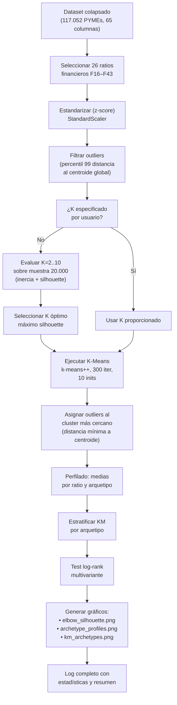

# Solución: Descubrimiento de Arquetipos Financieros

## Descripción

Implementación del enfoque híbrido descrito en la Sección~\ref{sec:clustering_km} del paper, que integra **aprendizaje no supervisado (K-Means)** con **análisis de supervivencia no paramétrico (Kaplan-Meier)** para estratificar el riesgo de insolvencia en PYMEs basándose en el perfil multidimensional de sus ratios financieros.

## Archivo

`archetype_clustering.py` — script autónomo que orquesta las dos fases del método (~470 líneas). Invocación:

```bash
python3 archetype_clustering.py [--k K] [--k-range INICIO,FIN] [--outlier-pct P] [--no-outlier-filter]
```

---

## Diagrama general del proceso



---

## Fase 1: Descubrimiento de Arquetipos (Clustering)

### 1a. Carga y selección de variables

Se carga `datasets/all_collapsed.csv` (117.052 empresas, 65 columnas). De estas, se seleccionan las **26 variables de ratios financieros** (`RATIO_COLS`):

```python
RATIO_COLS = (
    [f'F{i}' for i in range(16, 26)]    # F16–F25  (10 ratios)
    + [f'F{i}' for i in range(27, 32)]  # F27–F31  (5 ratios)
    + [f'F{i}' for i in range(33, 44)]  # F33–F43  (11 ratios)
)
```

Estas columnas son variables continuas que capturan distintos aspectos de la situación financiera de la PYME: rentabilidad, liquidez, endeudamiento, rotación, etc. Los datos llegan **ya preprocesados** (imputación de missings, estandarización preliminar) desde la etapa de *dataset_preprocessing*.

Adicionalmente se aplica una **segunda estandarización** con `StandardScaler` de scikit-learn para garantizar media 0 y varianza 1 en todas las dimensiones, requisito indispensable para que K-Means no se vea sesgado por la escala de cada variable.

### 1b. Filtrado de outliers

**Problema detectado:** Los datos presentan outliers extremos en el espacio de 26 dimensiones. Con K-Means estándar, estos outliers forman clusters de 1–2 elementos, degenerando la partición y haciendo que el coeficiente de silueta sea artificialmente alto (≈0.99) porque los clusters diminutos están "perfectamente separados" del cluster masivo.

**Solución:** Filtrado basado en distancia euclídea al centroide global del conjunto de datos:

```python
center = X.mean(axis=0)
dists = np.linalg.norm(X - center, axis=1)
threshold = np.percentile(dists, percentile)   # default: percentil 99
mask = dists <= threshold
```

Se retiene el percentil 99 de las empresas más próximas al centro, eliminando temporalmente el 1% más extremo (≈1.171 empresas v/s 115.881 retenidas). Este umbral es configurable mediante `--outlier-pct`.

**Importante:** Los outliers no se descartan definitivamente. Una vez ajustado K-Means sobre los datos filtrados, se les asigna la etiqueta del cluster cuyo centroide está más próximo:

```python
dists = km.transform(X_full[outliers])
full_labels[outliers] = dists.argmin(axis=1)
```

### 1c. Determinación de K óptimo

Se evalúa el rango K=2..10. Para cada K:

1. Se extrae una **muestra aleatoria de 20.000 empresas** (`SAMPLE_FOR_K = 20000`) para acelerar el cómputo, ya que ajustar K-Means sobre 115.000 puntos para 9 valores de K sería computacionalmente costoso.
2. Se ajusta K-Means sobre la muestra.
3. Se calculan dos métricas:

   - **Inercia** (within-cluster sum of squares): $\sum_{i=1}^{n} \min_{\mu_j \in C} \|x_i - \mu_j\|^2$
   
   - **Coeficiente de silueta**: $s(i) = \frac{b(i) - a(i)}{\max\{a(i), b(i)\}}$ donde $a(i)$ es la distancia media intra-cluster y $b(i)$ la distancia media al cluster vecino más cercano.

El K óptimo se selecciona maximizando el coeficiente de silueta. En los datos analizados:

| K | Inercia | Silhouette |
|---|---------|------------|
| 2 | 41.087 | **0,3453** |
| 3 | 31.080 | 0,3028 |
| 4 | 27.064 | 0,2893 |
| … | … | … |
| 10 | 17.271 | 0,2141 |

**K=2** emerge como el valor óptimo, indicando que la estructura latente del espacio financiero de las PYMEs se organiza en dos grandes arquetipos. Se genera `plots/elbow_silhouette.png`.

### 1d. Ejecución de K-Means

Con K determinado (automático o manual), se ejecuta K-Means sobre los **datos filtrados** (115.881 empresas × 26 ratios):

```python
KMeans(n_clusters=best_k, random_state=42,
       max_iter=300, n_init=10)
```

- **Inicialización:** `k-means++` (default en scikit-learn) — los centroides iniciales se eligen con probabilidad proporcional a su distancia a centroides ya seleccionados, mejorando la convergencia.
- **Número de inits:** 10 — se ejecutan 10 inicializaciones distintas y se retiene la de menor inercia.
- **Tolerancia:** tol=1e-4 (default) — el algoritmo converge cuando la inercia varía menos de 1e-4 entre iteraciones.
- **Semilla:** `random_state=42` para reproducibilidad.

Tras el ajuste, las etiquetas se extienden a los 1.171 outliers mediante distancia mínima al centroide. Esto garantiza que las 117.052 empresas tengan una asignación de arquetipo.

### 1e. Perfilado de arquetipos

Para cada cluster se calcula el vector de **medias estandarizadas** por ratio financiero. El perfil se construye con:

```python
profile = df[ratio_cols + ['Archetype']].groupby('Archetype').agg(['mean', 'std', 'count'])
```

La interpretación automática identifica los ratios con mayor desviación absoluta respecto a la media global (|media| > 0.3) y los usa como etiquetas descriptivas. Por ejemplo, si el arquetipo 0 tiene medias altas en F17 y F18, se etiqueta como `F17↑ | F18↑`.

Se genera `plots/archetype_profiles.png`: gráfico de barras agrupadas donde cada grupo de barras (posición X) es un ratio financiero y cada barra dentro del grupo es un arquetipo. Las barras representan la media estandarizada, con colores diferenciados por arquetipo.

---

## Fase 2: Validación mediante Supervivencia

### 2a. Estimador de Kaplan-Meier estratificado

Para cada arquetipo $k$ se estima la función de supervivencia $\hat{S}_k(t)$ mediante el estimador de Kaplan-Meier:

$$\hat{S}_k(t) = \prod_{i: t_i \leq t} \left(1 - \frac{d_i}{n_i}\right)$$

donde $t_i$ son los tiempos de evento, $d_i$ el número de eventos en $t_i$, y $n_i$ el número de empresas en riesgo justo antes de $t_i$.

Se utiliza la implementación de `lifelines.KaplanMeierFitter`, que maneja:
- **Censura por la derecha** (empresas que no experimentan el evento durante el período de observación).
- **Entrada tardía** (`entry` = 0 para todas las empresas en el dataset colapsado).
- **Intervalos de confianza al 95%** usando la fórmula de Greenwood para la varianza.

Para cada arquetipo se reporta:
- Número de sujetos, eventos y censurados.
- Mediana de supervivencia (o "*No alcanzada*" si $\hat{S}(t_{max}) > 0.5$).
- Probabilidad de supervivencia a t = 1, 2, 3, 5, 10, 15, 20 años con IC 95%.

### 2b. Test de Log-Rank multivariante

Se aplica el test de log-rank para comparar las curvas de supervivencia de los $K$ arquetipos:

$$H_0: S_1(t) = S_2(t) = \ldots = S_K(t) \quad \forall t$$

El estadístico de prueba se calcula como:

$$\chi^2 = \left(\sum_{j=1}^{K} \frac{(O_j - E_j)^2}{V_j}\right) \sim \chi^2_{K-1}$$

donde $O_j$ son los eventos observados y $E_j$ los eventos esperados bajo $H_0$ para el grupo $j$. Se utiliza `lifelines.statistics.multivariate_logrank_test`.

En los resultados con K=2:
- $\chi^2 = 1.385,02$, $p = 3,78 \times 10^{-303}$, $gl = 1$


### 2c. Visualización

Se genera `plots/km_archetypes.png` con:
- Una curva por arquetipo, coloreada con la paleta `Set2`.
- Intervalos de confianza al 95% (bandas semitransparentes).
- Línea vertical discontinua en el punto donde $\hat{S}(t) = 0.5$ para cada grupo, con etiqueta del año de cruce.
- Línea horizontal roja en S(t) = 0.5 (umbral de riesgo).
- Anotación del p-valor del log-rank en la esquina inferior derecha.

---

## Detalles de implementación adicionales

### Módulos y dependencias

| Dependencia | Uso |
|-------------|-----|
| `sklearn.cluster.KMeans` | Algoritmo de clustering principal |
| `sklearn.metrics.silhouette_score` | Validación interna para selección de K |
| `sklearn.preprocessing.StandardScaler` | Estandarización z-score |
| `lifelines.KaplanMeierFitter` | Estimación de supervivencia no paramétrica |
| `lifelines.statistics.multivariate_logrank_test` | Test de comparación de curvas |
| `matplotlib` + `Agg` backend | Generación de gráficos (sin display) |
| `pandas`, `numpy` | Manipulación de datos |

### Estructura de datos de entrada

El dataset `datasets/all_collapsed.csv` contiene **una fila por empresa** con el siguiente esquema:

| Columna | Tipo | Descripción |
|---------|------|-------------|
| `CIF` | string | Identificador fiscal único |
| `N1`–`N15` | mixto | Variables no financieras (sector, forma jurídica, tamaño, etc.) |
| `F16`–`F43` | float | Ratios financieros estandarizados (26 columnas) |
| `Start` | int | Tiempo de inicio (siempre 0 tras colapsar) |
| `Stop` | int | Tiempo de supervivencia en años |
| `Event` | int | 1 si ocurre insolvencia, 0 si censurado |
| `dataset` | string | Partición: TRAIN o TEST |

El colapsado (formato *counting-process* a una fila por empresa) se realiza en `survival_analysis.load_and_prepare()`.

### Flujo de control en main()

```
main()
├── argparse (--k, --k-range, --outlier-pct, --no-outlier-filter)
├── load_and_prepare() → df, ratio_cols
├── StandardScaler → X_full
├── [Opcional] remove_outliers(X_full, percentile) → filter_mask
│   └── X = X_full[filter_mask]
├── [Si --k es None] find_optimal_k(X, k_range, logger)
│   ├── Para cada K en k_range:
│   │   ├── KMeans.fit_predict(muestra 20.000)
│   │   ├── silhouette_score()
│   │   └── logger.info(K, inercia, silhouette)
│   └── best_k = argmax(silhouette)
├── run_kmeans(X, best_k) → km
├── assign_outliers(X_full, X, km, filter_mask) → labels
├── profile_archetypes(df, labels, ratio_cols, logger)
├── plot_archetype_profiles(profile, ratio_cols)
├── analyze_survival(df, labels, logger)
│   ├── Para cada arquetipo:
│   │   ├── KaplanMeierFitter.fit() → kmf
│   │   └── log_base_results()
│   ├── multivariate_logrank_test()
│   └── plot_stratified_survival(fitters, p_value)
└── logger.info(resumen final)
```

### Manejo de errores y robustez

- **Clusters pequeños:** Si un cluster tiene menos de 5 empresas, se omite de `profile_summary` y del análisis de supervivencia.
- **KM fallido:** `fit_km_safe` envuelve `KaplanMeierFitter.fit()` en try/except y retorna `None` si no hay suficientes sujetos (<5) o eventos (<1).
- **Log-rank fallido:** Captura excepciones y continúa sin p-valor si el test no puede calcularse.
- **Columnas faltantes:** Si alguna columna de `RATIO_COLS` no existe en el dataset, se omite automáticamente con un aviso en consola.

---

## Parámetros de configuración

| Constante | Valor | Descripción |
|-----------|-------|-------------|
| `RANDOM_STATE` | 42 | Semilla global para reproducibilidad |
| `MAX_KMEANS_ITER` | 300 | Iteraciones máximas por ejecución de K-Means |
| `N_INIT` | 10 | Número de inicializaciones de K-Means |
| `CLUSTER_RANGE` | range(2, 11) | Rango de búsqueda de K óptimo |
| `SAMPLE_FOR_K` | 20.000 | Tamaño de muestra para optimización de K |
| `OUTLIER_PERCENTILE` | 99.0 | Percentil para filtrado de outliers |
| `FIGURE_SIZE` | (14, 8) | Dimensiones de figuras matplotlib |

```python
# Configuración en archetype_clustering.py
RANDOM_STATE = 42
MAX_KMEANS_ITER = 300
N_INIT = 10
CLUSTER_RANGE = range(2, 11)
SAMPLE_FOR_K = 20000
OUTLIER_PERCENTILE = 99.0
FIGURE_SIZE = (14, 8)
```
